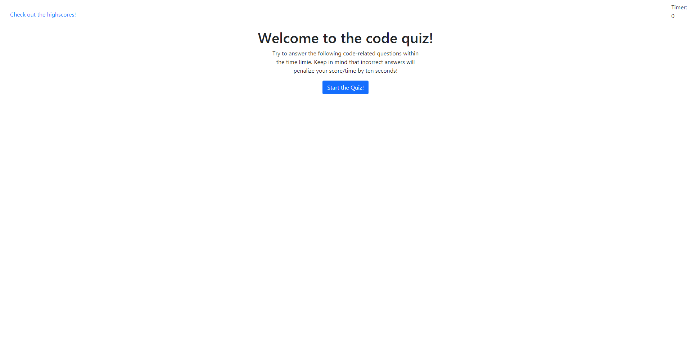
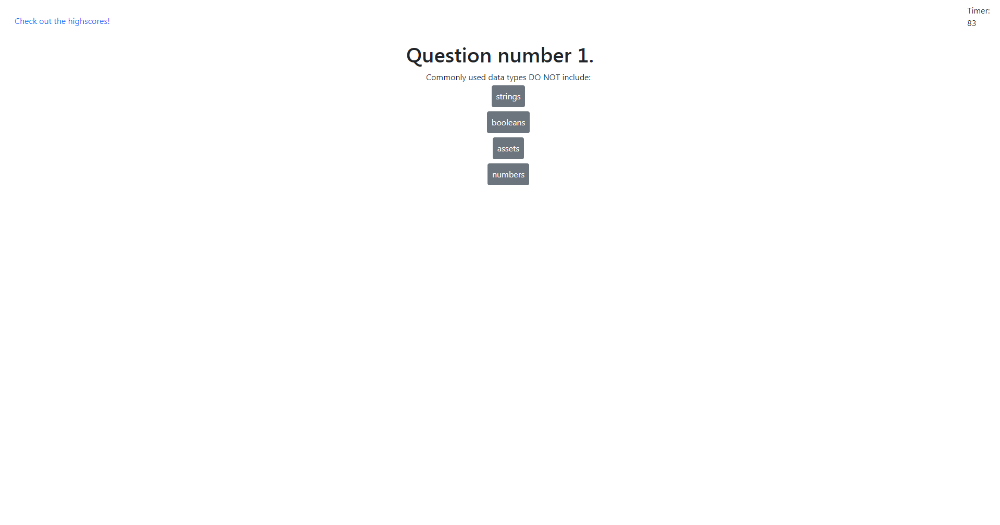

## **Web API Quiz**
---

#### **Table of Contents**
---
1. [Installalation](#installation)
1. [Trials](#trials)
1. [Usage](#usage)
1. [Credits](#credits)
1. [License](#license)

#### **Installation**
---

1. Make the html page containing the start button and instructions how to play.
1. Make the question objects with correct and incorrect answers.  Specify which one is correct.
1. Make a timer to count down as the quiz is being taken, as this is the score.
1. Make a on click event for the start button to start the init().
1. Remove the old content.
1. Dynamically build (using DOM) the structures to make new questions appear with selections.
1. Make an on click event to determine if a selection was pick, and if the answer is correct or incorrect.
1. Make the question number iterate and remove the old html with DOM and rebuild with a new question.
1. Display the congratulation screen, displaying the score, and allow them to enter their initials.
1. Store initials and score into local storage and use them to display a html page for the high scores.

#### **Trials**
---

The trials in this project were many.  The scope of this project was much higher than I anticipated, and many many things went wrong. My first major problem was scope of my functions, I kept trying to call things that were in other functions.  I ended up having to re-write a few functions to make them all work, but I learned a valuable lesson.  DOM was a struggle for me at first, but now I think I have it quite under control and it shouldn't hopefully be an issue in the future.  The last trial I had was event.target and how this function, this threw me through a loop.

#### **Usage**
---
The usage of the website is fairly simple.  You start with a basic screen.

Click the start button and you should see a question and you select the answer you think is correct.  From there you continue till finish and input your initials and your score will be saved.

#### **Credits**
---
Thanks to my tutor Bryon Brown for teaching my local storage.
Thanks to my TA Peter for helping with my timer.
Thanks to my classmates Molly, Pete, and any others who gave me advice.

#### **License**
---

Copyright (c) 2005-2020 David Heinemeier Hansson

Permission is hereby granted, free of charge, to any person obtaining
a copy of this software and associated documentation files (the
"Software"), to deal in the Software without restriction, including
without limitation the rights to use, copy, modify, merge, publish,
distribute, sublicense, and/or sell copies of the Software, and to
permit persons to whom the Software is furnished to do so, subject to
the following conditions:

The above copyright notice and this permission notice shall be
included in all copies or substantial portions of the Software.

THE SOFTWARE IS PROVIDED "AS IS", WITHOUT WARRANTY OF ANY KIND,
EXPRESS OR IMPLIED, INCLUDING BUT NOT LIMITED TO THE WARRANTIES OF
MERCHANTABILITY, FITNESS FOR A PARTICULAR PURPOSE AND
NONINFRINGEMENT. IN NO EVENT SHALL THE AUTHORS OR COPYRIGHT HOLDERS BE
LIABLE FOR ANY CLAIM, DAMAGES OR OTHER LIABILITY, WHETHER IN AN ACTION
OF CONTRACT, TORT OR OTHERWISE, ARISING FROM, OUT OF OR IN CONNECTION
WITH THE SOFTWARE OR THE USE OR OTHER DEALINGS IN THE SOFTWARE.

